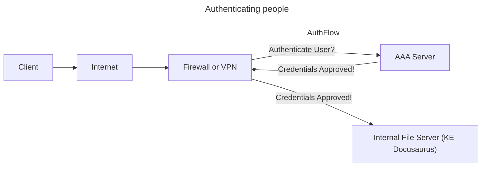

# 1.0 General Security Concepts

## 1.1 Compare and contrast various types of security controls

| Controls and Types | Preventive         | Deterrent      | Directive                       | Detective            | Corrective          | Compensating                    |
|:-------------------|:-------------------|:---------------|:--------------------------------|:---------------------|:--------------------|:--------------------------------|
| Technical          | Firewall           | Splash screen  | File storage policies           | System logs          | Backup recovery     | Block instead of patch          |
| Operational        | Guard checkpoint   | Reception desk | Security policy training        | Property patrols     | Contact authorities | Require multiple security staff |
| Managerial         | On-boarding policy | Demotion       | Compliance policies             | Review login reports | Issue reporting     | Separation of duties            |
| Physical           | Door lock          | Warning signs  | Sign: Authorized Personnel Only | Motion detectors     | Fire estinguisher   | Power generator                 |

### Control Categories
- Technical controls
    - controls implemented by **systems** (firewalls, anti-virus)
- Operational controls
    - controls implemnted by **people** instead of systems (security guards, awareness programs)
- Managerial controls
    - **administrative** controls associated with security design and implementation (security policies, standard operating procedures)
- Physical controls
    - limit **physical** access (physical locks, badge readers)

### Control Types
- Preventive (Pre-Process)
    - blocks access to a resource
- Deterrent (Pre-Process)
    - discourage an intrusion attempt
- Directive (Pre-Process)
    - direct a person towards security compliance
    - **relatively weak security control i.e. Do This, Please...**
    - Ex. Don't store data with PII locally.
- Detective (Active-Process)
    - identify and log an intrusion attempt
- Corrective (Post-Process)
    - apply a control after an event has been detected
- Compensating (Post-Process)
    - control using other means and typically temporary
    - **Ex. backup power generator while the main power is down**

## 1.2 Summarize fundamental security concepts

### Confidentiality, Integrity, and Availability (CIA)
Sometimes referred to as the AIC Triad, not to be confused with the federal agency Central Intelligency Agency (CIA)... no correlation. The CIA Triad are the *fundamentals* of IT Security.

- **Confidentiality:** prevent unauthorized users from accessing private information
    - Encryption: encode messages so only certain people can read it
    - Access controls: restrict access to resources
    - 2FA: addtional confirmation before info is disclosed

- **Integrity:** ensure recieved messages are exactly what was sent and not tampered with
    - Hashing: maps data of arbitrary length to data of fixed length 
        - The sender provides both the data and the hash
        - If the data matches the sender's hash, after passing the data through the same hash function, then you know the data you received is exactly the same as the data that was sent
    - Digital Signature: takes a hash and encrypts it with an asymmetric encryption algorithm
        - This means we can check for data integrity and we can confirm the person who sent the data
    - Certificates: used to identify devices or people
        - Combine with a digital signature to verify an individual
    - Non-repudiation: provides proof of integrity
        - This guarantees data we received came from the originating party

- **Availability:** systems must be up and running at all times
    - Redundancy: build services that will always be available
    - Fault tolerance: system will continue to run, even when a failure occurs
    - Patching: update systems to ensure stability and close security holes

### Non-repudiation
Like signing a contract, your signature adds non-repudiation, there's no take backsies.

Similar idea in cryptography through:
- **Proof of integrity:** verify the data does not change
    - Hash: represent data as a short string of text, sometimes referred to as a fingerprint
        - So if the data changes, the hash changes, just like if a person changes, you get a different fingerprint.
        - Only tells you if the data changed, not the individual who sent
        - If the hash is different, something changed, which means the data integrity has been compromised
- **Proof of origin, with high assurance of authenticity:** verify the person who sent the data to us
    - Digital Signature: sign with a private key
        - This private key is only known to the sender, the person who is sending the data. No one else has access to the private key.
        - To verify against the private key used, the receiver uses the public key associated with that private key.
            - This ensures proof of integrity and it was sent by the person who provided the digital signature
        - Any tampering will invalidate the signature

More info, with a visual demonstration [here](https://www.youtube.com/watch?v=XxnCxPEllMg&list=PLG49S3nxzAnl4QDVqK-hOnoqcSKEIDDuv&index=4)

### Authentication, Authorization, and Accounting (AAA)
Identification: who you claim to be, usually your username

Authentication: who are you *really*, usually password and 2FA

Authorization: what can you do, usually permissions

Accounting: resources used like login/logout time or data sent and received, usually logs 

- Authenticating systems:
    - Put a digitially signed certificate on a system / device
    - Access to a VPN from authorized devices
    - Management software can validate the end device

**Certificate Authority (CA):** most organizations maintain their own CAs
- The organizations creates a certificate for a device
- And digitally signs the certificate with the organization's CA
- The certificate can now be included on a device as an authentication factor
    - The CA's digital signature is used to validate the certificate

- Authorization models:
    - What do they have access to?
    - Roles, Organizations, Tasks

### Gap Analysis
- Where you are vs where you want to be
- Determine end goal by working towards a baseline
    - NIST Special Publication 800-171 Revision 2, Protecting Controlled Unclassified Information in Nonfederal Systems and Organizations
    - ISO/IEC 27001, Information security management systems
- Compare and Contrast
    - evaluate existing systems and identify weaknesses based on the most effective processes
    - examine broad security categories and break them into smaller segments
- Analysis and Report
    - formal description of the current state
    - recommendations for meeting the baseline

### Zero Trust
- Holistic approach to network security
    - covers every device, process, and person
    - you have to authenticate each time you want to access a resource
- Planes of operation (Data Plane and Control Plane)
    - Data Plane
        - Processes the frames, packets, and network data
        - Processing, forwarding, trunking, encrypting, NAT
        - Implicit trust zones
            - Looks at where someone is connected from and where they are trying to go
            - Auto deny someone trying to go from an **untrusted** to a **trusted** zone
        - Subject / System
            - users, apps, or processes trying to reach an trusted / enterprise resource
        - Policy Enforcement Point: gatekeeper for a subject / system
            - used to allow, monitor, and terminate connections
            - only gathers all network info but doesn't make a decision
        - Policy Decision Point: consists of a policy engine and policy administrator
            - policy engine makes the decision to grant, deny, or revoke based on the policy
            - policy administrator communicates with the Policy Enforcement Point
                - generates access tokens if allowed otherwise tells PEP to disallow access
    - Control Plane
        - Manage actions of data plane, define policies and rules
        - Determines how packets should be forwarded
        - Routing tables, session tables, NAT tables
        - Adaptive identity
            - Consider the source and requested resources
            - Make the authentication stronger, if needed
        - Threat scope reduction
            - Decrease the number of possible entry points
        - Policy-driven access control
            - Combine adaptive identity with a predefined set of rules

### Physical Security

- Barricades / Bollards
    - prevent access or channel people
- Access control vestibules
    - locked doors to manage control through an area
- Fences
    - usually obvious and difficult to enter
- Video surveillance
    - CCTV (Closed Circuit Television)
    - May have motion recognition or object detection
    - often many cameras networked together and sent to one single storage point
- Gaurds and Access badges
    - security gaurd for physical protection and to validate identities of employees
    - usually two-person integrity so not a single person has a access to a physical asset
    - access badges worn at all times and has identfying information
- Lighting
    - Easier for people and cameras to see
- Infrared
    - Detects infrared radiation in both light and dark
    - Common in motion detectors
- Pressure
    - Detects a change in force
    - Floor and window sensors
- Microwave
    - Detects movement across large areas
- Ultrasonic
    - Send ultrasonic signals, receive reflected sound waves
    - Detects motion, collision, etc.

### Deception and Disruption
- Honeypots: attract the bad guys and trap them here
    - generally a virtual world to explore
    - usually the 'attacker' is a bot, makes for interesting recon
    - many different options, most are open source and availabe to download
    - constant battle on both sides to discern real from fake
- Honeynets: create a more realistic honeypot by incorporating physical network devices
    - servers, workstations, routers, switches, firewalls, etc.
    - can include multiple honeypots within
    - https://projecthoneypot.org
- Honeyfiles: files with fake info like passwords.txt
    - an alert is sent if file is accessed (virtual bear trap)
- Honeytoken: used to track malicious actors
    - fake api credentials, credentials, or emails with notifications sent when used
    - many other examples like database records, browser cookies, webpage pixels

## 1.3 Explain the importance of change management processes and the impact to security

### Change Management (Process for what needs to change)
- One of the most common risks in the enterprise (DevOps can help mitigate this...)
- Generally there's an approval process that looks something like this
    - Complete the request forms
    - Determine the purpose of the change
    - Identify the scope of the change
    - Schedule a data and time of the change
    - Determine affected systems and the impact
    - Analyze the risk associated with the change (and risk of not going along with it)
    - Get approval from the change control board
    - Get end-user acceptance after the change is complete

- Ownership: individual or entity that need the change
    - They own the process but don't (usually) perform the actual change
    - They manage the process and get updates

- Stakeholders: those affected by this change
    - May not always be obvious, a small change can affect only one individual or the entire company

- Impact Analysis: determine risk value (high, medium, low)
    - The "fix" may not fix anything, it could break something like OS failures or data corruption
    - Risks of not making the change typically include security vulnerabilities or unexpected downtime to an app or service

- Test Results: use a sandbox testing environment that mimics prod as close as possible
    - Apply the patch to the sandbox environment, test and confirm before prod deployment
    - Confirm the backout plan in the sandbox environment too, in case it doesn't go as planned in prod

- Backout Plan: a way to revert back to the original or very similar configuration before the patch
    - Always have backups - plan for the worst, hope for the best

- Maintenance Window: time when the patch will happen
    - Generally done during off-peak hours
    - 24-hr prod envs can be difficult and time of the year may play a factor 
        - Most companies incorporate a blackout period, i.e. during the holiday season, where no maintenance can occur

- Standard Operating Procedure: well documented process for handling change management
    - Affects everyone in the organization, should be available to all employees, and a living document

### Technical Change Management (Process for how to change it)
- Allow / Deny List: certain apps can be dangerous
    - Some apps may include trojan horses, vulnerabilities, malware
    - Allow list
        - Very restrictive as nothing runs unless its approved
    - Deny list
        - Nothing on this list can be run, anti-virus usually catches these

- Restricted activities: limited to only what's listed in the change control document
    - There should be processes defined for how to change the scope if trouble arises during the patch

- Downtime: when a service is unavailable
    - for 24-hr prod envs, switch to a secondary system while the primary is updated, then switch to the primary
    - minimize downtime events by automating the process as much as possible
    - should be part of the backout plan and communication is key, consider a centralized change control calendar

- Service restart: common to implement new configuration

- Legacy applications: no longer supported by a developer

- Dependencies: modifying one component may require changing or restarting other components

- Documentation: require it with the change management process
    - updating diagrams
    - updating policies / procedures
        - adding new systems may require new procedures

- Version control: track changes to configuration over time
    - easy to revert to a previous setting

## 1.4 Explain the importance of using appropriate cryptographic solutions

### Public key infrastructure (PKI)

- Symmetric encryption: encrpyting and decrypting info with the same key
    - if it gets exposed, you'll need another
    - sometimes referred to as secret key algorithm or shared secret
    - doesn't scale well as it can be challenging to distribute
    - however it's very fast so often combined with asymmetric encryption

- Asymmetric encryption: encrypting and decrypting info with different keys
    - Public key cryptography: known as public and private keys
        - Two (or more) mathematically related keys using large prime numbers
        - The private key is the only key that can decrypt data encrypted with the public key
            - The private key can't be derived from the public key
        - PGP and GPG use public key encryption
            **-Look into quantum-resistant algorithms to avoid vulnerabilities with "harvest now, decrypt later" attacks**

- Key Escrow
    - In an organization, there may be hundreds or thousands users with their own public-private key pairs
        - You may need to hand them to a third party and only request them when you need them
            - May seem controversial but sometimes require to maintain availability
            - If a person leaves the company, you can still access their work because you have their private key
        - You may choose to manage your own key escrow within your organization

### Encryption

- Protecting data on storage devices, known as data at rest
    - Full-disk and partition / volume encrpytion
        - BitLocker - Windows, FileVault - Mac, etc.
    - File encryption
        - EFS - Windows (Encrypting File System)
        - Third-party tools 
    - Database
        - Symmetric encryption on the entire DB
        - Record-level encryption uses separate symmetric keys for different columns of interest such as SSN

- Transport encryption
    - protect data traversing the network like HTTPS
    - VPN (Virtual Private Network)
        - encrypts all data transmitted over the network, regardless of the application
        - Client-based VPN using SSL/TLS
        - Site-to-site VPN using IPsec

- Encryption algorithms
    - both sides decide on algorithm to use
    - pros and cons to all algorithms such as security level, speed, and complexity of implementation

- Key lengths
    - larger keys tend to be more secure as they can prevent brute-force attacks
    - 128-bit or larger for symmetric keys are common
    - 3072-bit or larger for asymmetric keys are common

- Key stretching or key strengthing
    - apply multiple processes on a key
    - hash a password, then hash the hash of the password, so on and so forth...
        - even though the key is small, makes brute force attacks take longer

- Exchanging keys
    - Use asymmetric encryption to deliver a symmetric key
        - often used with session keys as they are ephemeral (they only last for a short time)
    - Use an asymmetric key to make a symmetric key
        - Bob has his own private key and uses Alice's public key
        - Alice has her own private key and uses Bob's public key
        - Both combinations make the same symmetric key locally
            - This is great because both users have the same symmetric key but there was no transportation required

### Tools
- Trusted Platform Module (TPM): Cryptography hardware that provides encryption functions for a device
    - Used for RNG and has persistent memory, may also be used to burn unique keys during manufacturing
    - Securely stores keys and is password protected

- Hardware Security Module (HSM): Used in large environments
    - Securely stores thousands of cryptographic keys
    - Offloads the CPU overhead from other devices to generate these keys

- Key Management System: manage all keys from a centralized system
    - On-premises or cloud-based key management from one console
    - Useful for creating keys for different services, users, rotating keys, and logging key use
    - **Look into Key Manager Plus by ManageEngine**

- Security Enclave: a protected area for secrets
    - often implemented as a hardware processor and isolated from the main processor
    - provides extensive security features
        - RNG, perform AES encryption, etc.

### Obfuscation
The process of making something unclear

- Generally involves hiding data in plain sight

- Stenganography
    - Hides data within an image, video, or audio file (Greek for 'concealed writing')
        - Message is invisible but it's really there
        - Covertext is the document with the info you are hiding

- Tokenization
    - Replaces sensitive data with a non-sensitive placeholder
        - [Common with credit card processing](https://youtu.be/LfuTMzZke4g?feature=shared&t=295)
            - sends 1 time tokens across the network
        - This isn't encrypting or hashing
            - the original data and token aren't mathematically related

- Data Masking
    - Hides some of the orginal data like only showing the last 4 numbers of your phone number
    - Protects PII
    - Many different techniques such as shuffling, substituting, or encrypting
