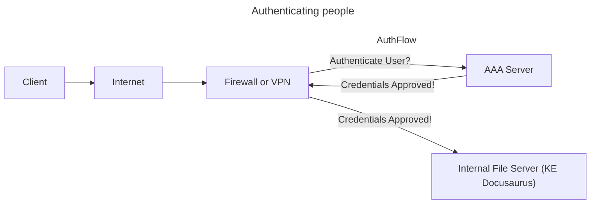

# 1.0 General Security Concepts

## 1.1 Compare and contrast various types of security controls

| Controls and Types | Preventive         | Deterrent      | Directive                       | Detective            | Corrective          | Compensating                    |
|:-------------------|:-------------------|:---------------|:--------------------------------|:---------------------|:--------------------|:--------------------------------|
| Technical          | Firewall           | Splash screen  | File storage policies           | System logs          | Backup recovery     | Block instead of patch          |
| Operational        | Guard checkpoint   | Reception desk | Security policy training        | Property patrols     | Contact authorities | Require multiple security staff |
| Managerial         | On-boarding policy | Demotion       | Compliance policies             | Review login reports | Issue reporting     | Separation of duties            |
| Physical           | Door lock          | Warning signs  | Sign: Authorized Personnel Only | Motion detectors     | Fire estinguisher   | Power generator                 |

### Control Categories
- Technical controls
    - controls implemented by **systems** (firewalls, anti-virus)
- Operational controls
    - controls implemnted by **people** instead of systems (security guards, awareness programs)
- Managerial controls
    - **administrative** controls associated with security design and implementation (security policies, standard operating procedures)
- Physical controls
    - limit **physical** access (physical locks, badge readers)

### Control Types
- Preventive (Pre-Process)
    - blocks access to a resource
- Deterrent (Pre-Process)
    - discourage an intrusion attempt
- Directive (Pre-Process)
    - direct a person towards security compliance
    - **relatively weak security control i.e. Do This, Please...**
    - Ex. Don't store data with PII locally.
- Detective (Active-Process)
    - identify and log an intrusion attempt
- Corrective (Post-Process)
    - apply a control after an event has been detected
- Compensating (Post-Process)
    - control using other means and typically temporary
    - **Ex. backup power generator while the main power is down**

## 1.2 Summarize fundamental security concepts

### Confidentiality, Integrity, and Availability (CIA)
Sometimes referred to as the AIC Triad, not to be confused with the federal agency Central Intelligency Agency (CIA)... no correlation. The CIA Triad are the *fundamentals* of IT Security.

- **Confidentiality:** prevent unauthorized users from accessing private information
    - Encryption: encode messages so only certain people can read it
    - Access controls: restrict access to resources
    - 2FA: addtional confirmation before info is disclosed

- **Integrity:** ensure recieved messages are exactly what was sent and not tampered with
    - Hashing: maps data of arbitrary length to data of fixed length 
        - The sender provides both the data and the hash
        - If the data matches the sender's hash, after passing the data through the same hash function, then you know the data you received is exactly the same as the data that was sent
    - Digital Signature: takes a hash and encrypts it with an asymmetric encryption algorithm
        - This means we can check for data integrity and we can confirm the person who sent the data
    - Certificates: used to identify devices or people
        - Combine with a digital signature to verify an individual
    - Non-repudiation: provides proof of integrity
        - This guarantees data we received came from the originating party

- **Availability:** systems must be up and running at all times
    - Redundancy: build services that will always be available
    - Fault tolerance: system will continue to run, even when a failure occurs
    - Patching: update systems to ensure stability and close security holes

### Non-repudiation
Like signing a contract, your signature adds non-repudiation, there's no take backsies.

Similar idea in cryptography through:
- **Proof of integrity:** verify the data does not change
    - Hash: represent data as a short string of text, sometimes referred to as a fingerprint
        - So if the data changes, the hash changes, just like if a person changes, you get a different fingerprint.
        - Only tells you if the data changed, not the individual who sent
        - If the hash is different, something changed, which means the data integrity has been compromised
- **Proof of origin, with high assurance of authenticity:** verify the person who sent the data to us
    - Digital Signature: sign with a private key
        - This private key is only known to the sender, the person who is sending the data. No one else has access to the private key.
        - To verify against the private key used, the receiver uses the public key associated with that private key.
            - This ensures proof of integrity and it was sent by the person who provided the digital signature
        - Any tampering will invalidate the signature

More info, with a visual demonstration [here](https://www.youtube.com/watch?v=XxnCxPEllMg&list=PLG49S3nxzAnl4QDVqK-hOnoqcSKEIDDuv&index=4)

### Authentication, Authorization, and Accounting (AAA)
Identification: who you claim to be, usually your username

Authentication: who are you *really*, usually password and 2FA

Authorization: what can you do, usually permissions

Accounting: resources used like login/logout time or data sent and received, usually logs 

- Authenticating systems:
    - Put a digitially signed certificate on a system / device
    - Access to a VPN from authorized devices
    - Management software can validate the end device

**Certificate Authority (CA):** most organizations maintain their own CAs
- The organizations creates a certificate for a device
- And digitally signs the certificate with the organization's CA
- The certificate can now be included on a device as an authentication factor
    - The CA's digital signature is used to validate the certificate

- Authorization models:
    - What do they have access to?
    - Roles, Organizations, Tasks

### Gap Analysis
- Where you are vs where you want to be
- Determine end goal by working towards a baseline
    - NIST Special Publication 800-171 Revision 2, Protecting Controlled Unclassified Information in Nonfederal Systems and Organizations
    - ISO/IEC 27001, Information security management systems
- Compare and Contrast
    - evaluate existing systems and identify weaknesses based on the most effective processes
    - examine broad security categories and break them into smaller segments
- Analysis and Report
    - formal description of the current state
    - recommendations for meeting the baseline

### Zero Trust
- Holistic approach to network security
    - covers every device, process, and person
    - you have to authenticate each time you want to access a resource
- Planes of operation
    - Data Plane
        - Processes the frames, packets, and network data
        - Processing, forwarding, trunking, encrypting, NAT
    - Control Plane
        - Manage actions of data plane, define policies and rules
        - Determines how packets should be forwarded
        - Routing tables, session tables, NAT tables

## 1.3 Explain the importance of change management processes and the impact to security

### Business processes impacting security operation

## 1.4 Explain the importance of using appropriate cryptographic solutions

### Public key infrastructure (PKI)