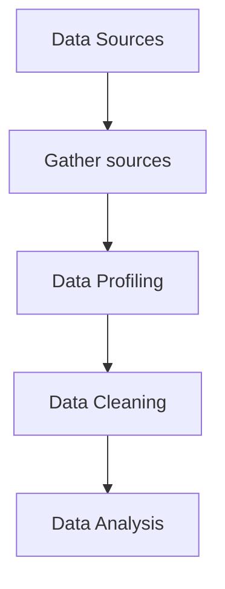

# Data Cleaning - Big Idea
- Quality dimensions - data should be:
    - accurate
    - timely
    - relevant
    - complete
    - understood
    - trusted

- Questions we want to ask of data:
    - Fitness for Use / Purpose: Is the quality sufficient to answer my questions?
    -   Is it free of defects and does it possess the features needed to complete the operation, make the decision, or complete the plan?

- Queries we want to execute:
    - Data profiling - get an overview of the kind of data we have
    - Checking Integrity Constraints (ICs) using SQL

# Data Cleaning Process
- Data from various sources are gathered

- Data Profiling
    - Identify, detect, quantify data quality problems

- Data Cleaning (Wrangling)
    - Standardize, normalize data
        - Controlled reference vocabularies

- Data Integration & Data Warehousing
    - Extract, Transform, Load (ETL) -> Data Warehouse
    - On demand integration (database mediators)

# Quantitative vs Qualitative Errors
- Quantitative
    - Outliers
        - deviate significantly from the distribution of values

- Qualitative
    - Syntactic violations
        - Pattern violations: variant data formats, spellings, ...
    - Schema / Integrity Constraints (IC) Violations
        - IC rule violations: Functional or inclusion dependencies
    - Duplicates and other errors
        - Distinct records refer to the same real-world entity

# Data Quality 
What are the questions you’re trying to answer? Do you even need this table / column / field?

## Pillars of Data Quality
- Organizational
    - Data quality objectives to establish processes, standards, policies
- Architectural
    - Tech landscape to deploy DQ objectives
- Computational
    - IT tools and techniques required to meet DQ objectives

## DQ Management Phases
- Context Reconstruction
    - collect context info on organizational processes, services, data management procedures, quality issues, costs
    - (skip if context info is available from previous analyses)

- Assessment/Measurement
    - measures DQ along relevant dimensions
    - assess DQ by comparing with reference values and identify the causes of poor DQ

- Improvement
    - concerns the selection of the steps, strategies, and techniques for reaching new data quality targets

## Data Quality Dimensions
- Accuracy
    - extent to which data are correct, reliable correspond to ground truth 
    - often focus on syntax and patterns (e.g. regex matching for dates)
- Completeness
    - degree to which a dataset includes necessary information about relevant objects
- Consistency
    - satisfaction or violation of schema or semantic rules
    - in relational databases: integrity constraints (ICs), often in the form of denials
- Timeliness
    - data change over time and is the data still appropriate?